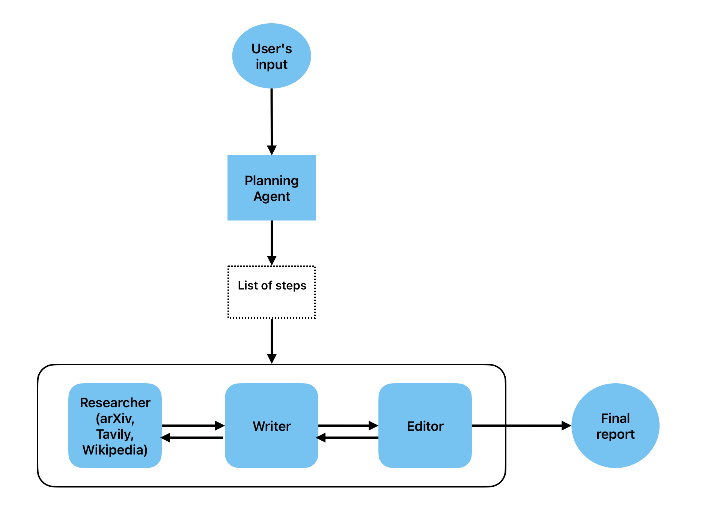

# Personal Agentic Researcher
Agentic system that acts as a personal researcher, capable of accessing different sources (Tavily, arXiv, Wikipedia) to provide state-of-the-art reports on diverse scientific topics.
Deployed locally as a FastAPI web app that stores task state/results in Postgres. This setup 
includes a docker compose structure that manages the two distinct components: a Postgres
container created from an image from Docker Hub and our own web app container.



## Features

* `/` serves a simple UI (Jinja2 template) to kick off a research task.
* `/generate_report` kicks off a threaded, multi-step agent workflow (planner → research/writer/editor).
* `/task_progress/{task_id}` live status for each step/sub-step.
* `/task_status/{task_id}` final status + report.

## Prerequisites

* **Docker** (Desktop on Windows/macOS, or engine on Linux).


* App API keys stored in a `.env` file inside the app directory:

  ```
  OPENAI_API_KEY=your-open-api-key
  TAVILY_API_KEY=your-tavily-api-key
  ```
* Postgres default variables for testing (can be overridden) stored in a `.env` file at the same level of the docker-compose.yaml:

  ```angular2html
  POSTGRES_USER=app
  POSTGRES_PASSWORD=local
  POSTGRES_DB=app
  ```
  
## Build & Run (local/dev)

### 1) Build and run

```bash
docker compose up --build
```

You should see logs like:

```
postgres_db  | 2026-03-25 12:00:47.094 UTC [1] LOG:  database system is ready to accept connections
Container postgres_db Healthy 
fastapi_app  | 🚀 Starting FastAPI...
fastapi_app  | INFO:     Started server process [7]
fastapi_app  | INFO:     Waiting for application startup.
fastapi_app  | INFO:     Application startup complete.
fastapi_app  | INFO:     Uvicorn running on http://0.0.0.0:8000 (Press CTRL+C to quit)
```

### 2) Open the app

* UI: [http://localhost:8000/](http://localhost:8000/)
* Docs: [http://localhost:8000/docs](http://localhost:8000/docs)

### 3) Stop and remove the containers

```bash
docker compose down -v
```
The `-v` flag tells docker to also remove the volume created to persist the data.

---

## API quickstart

### Kick off a run from the terminal

```bash
curl -X POST http://localhost:8000/generate_report \
  -H "Content-Type: application/json" \
  -d '{"prompt": "Large Language Models for scientific discovery", "model":"openai:gpt-4o"}'
```
This execution returns the task_id needed for polling the progress and getting the task status.

### Poll progress

```bash
curl http://localhost:8000/task_progress/<TASK_ID>
```

### Final status + report

```bash
curl http://localhost:8000/task_status/<TASK_ID>
```
